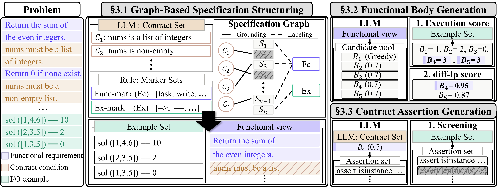

# SLICE: Specification-Level Isolation of Contract Enforcement

<p align="center">
  <a href="https://github.com/suhanmen/SLICE/stargazers">
    
  </a>
  <a href="https://github.com/suhanmen/SLICE/commits/main">
    
  </a>
  <a href="https://github.com/suhanmen/SLICE/graphs/contributors">
    
  </a>
</p>

<div align="center">
    <a href="https://arxiv.org/abs/2608.21483"><b>Paper Link</b>📖</a>
</div><br>

## 📰 News

- 📢 NEW! The official **SLICE** pipeline has been released on GitHub.

## 🔍 Motivation


| Feature                | 🚫 As-Is (one undivided generation)                                               | ✨ To-Be (SLICE)                                                                                          |
| ---------------------- | --------------------------------------------------------------------------------- | -------------------------------------------------------------------------------------------------------- |
| **Specification**      | **One undivided prompt** (contract conditions mixed into prose)                   | **Structured into a specification graph** (functional view + contract conditions)                        |
| **Generation**         | **Function body and assertions in a single process** (competing objectives)       | **Separate generation stages** (function body, then contract assertions)                                 |
| **Selection**          | 📉 **Multi-turn revision of one program** (regenerate or repair until tests pass) | 📈 **Generate once, select once** (five candidates ranked by execution scores; ties resolved by diff-lp) |
| **Assertion quality**  | **Unchecked** (an over-strict assertion silently rejects valid inputs)            | **Screened by execution** (assertions that reject example inputs are removed)                            |
| **SSR gain over Base** | 💸 **−9.04 ~ −0.45%**                                                             | ⚡ **+8.16%**                                                                                             |


Passing the tests is only half of what a specification asks for. A problem statement usually also says what the *inputs* must satisfy — "the list must be non-empty", "n must be a positive integer" — and a solution that computes the right answer but accepts an invalid input has not implemented the specification. Asking a model for both in one undivided generation — no decomposition of the specification — makes the two requirements compete: assertions drift into the function body, the implementation bends around them, and a single over-strict assertion silently rejects inputs the problem calls valid. **SLICE** asks the two questions separately, and lets each one be checked on its own terms.

## ✨ About SLICE
<p align="center">
  
</p>


**SLICE** (**S**pecification-**L**evel **I**solation of **C**ontract **E**nforcement) generates a function body and its input-validation assertions through separate generation stages, taking only the natural-language problem description as input — no reference solution, no held-out test.

SLICE decomposes contract-satisfying code generation into three stages.
**(i) Graph-based specification structuring** queries the LLM for the contract conditions stated in the description, grounds them to description segments in a specification graph, and removes contract-only segments to form a *functional view* — the description with contract prose taken out and the functional content and examples kept.
**(ii) Functional body generation** produces five candidate function bodies from the functional view (one greedy, four sampled at T = 0.7), ranks them by execution score on executable checks recovered from the description's examples, and resolves ties with **diff-lp**, the mean token log-probability over the lines on which the tied candidates differ.
**(iii) Contract assertion generation** converts each identified condition into one input-validation assertion with the selected function body as context, screens out assertions that reject the description's example inputs, and inserts the rest at the function entry.

## 🚀 What makes SLICE valuable?

✅ **A graph that extracts the contract precisely** — Contract conditions are embedded in prose next to the functional requirements, and SLICE's specification graph pulls them apart accurately: description segments and the extracted conditions become nodes, a segment is grounded to a condition only when *semantic correspondence* (embedding cosine ≥ 0.75) and *lexical grounding* (≥ 45% content-word overlap with the conditions and the signature) hold jointly, and a grounded segment is removed only if it carries no functional or example-preservation label. The separation is measurably precise — **98.83%** of what masking removes is contract-only prose (**95.48%** segment accuracy) — and it pays: generating the body from the functional view instead of the raw description raises SSR by **6.39%** and pass@1 by **7.21%** on average.

✅ **A selection signal recovered from the specification itself —** The description usually contains its own examples: doctests, `assert` lines, or prose of the form `f(a) = b`. SLICE converts them into executable checks (**94%** of tasks) and ranks the five candidate function bodies by execution score, resolving ties with **diff-lp**, which scores only the lines on which the tied candidates differ. No held-out test enters the loop — only what the model itself saw is executed. The pool genuinely changes the outcome: a sampled candidate, not the greedy one, is chosen on **42.94%** of tasks, and replacing the pool with a single greedy body costs **4.07%** SSR and **4.36%** pass@1 on average

✅ **Enforcement aligned with the stated contract and the chosen implementation** — Input-validation assertions are generated in a separate stage, from the identified contract conditions only, with the selected function body as context. The condition list keeps enforcement from inventing restrictions the specification never states; the body context makes the assertions use the actual parameter names and respect the chosen implementation; and the function body itself is generated from the functional view, never conditioned on contract text. This isolation cuts both failure modes at once: SLICE misses contract violations on **2.72%** of tasks on average, against **40.30%** for SpecFix and **6.91%** for CodeTree, while holding over-rejection to 2.06–4.12%.

## 📈 Results

> - **SSR (Specification Satisfaction Rate)** = fraction of tasks where functional correctness **and** contract satisfaction hold on the *same* output. 
> - **pass@1** = functional correctness of the complete generated function (assertions included) on valid inputs.
> - **CSR** = fraction of tasks whose every held-out contract-violating input is rejected.

Evaluated on **340 of the 364 ContractEval tasks** (the tasks that retain at least one valid check and one contract-violating test after contaminated checks are excluded). All methods are scored on the same frozen set.

**Main result — SLICE vs. Base prompting and prior work.**


| Model            | Method    | SSR        | pass@1     | CSR        |
| ---------------- | --------- | ---------- | ---------- | ---------- |
| **Llama-3.1-8B** | Base      | 46.18%     | 48.53%     | **94.12%** |
|                  | SpecFix   | 18.53%     | 50.88%     | 27.65%     |
|                  | CodeTree  | 49.41%     | 60.00%     | 82.35%     |
|                  | **SLICE** | **56.18%** | **61.18%** | 90.00%     |
| **Qwen-3.5-9B**  | Base      | 66.76%     | 68.24%     | **96.76%** |
|                  | SpecFix   | 5.29%      | 65.88%     | 6.47%      |
|                  | CodeTree  | 55.29%     | 61.76%     | 70.29%     |
|                  | **SLICE** | **74.41%** | **75.88%** | 95.88%     |
| **Gemma-4-12B**  | Base      | 76.76%     | 79.12%     | **96.18%** |
|                  | SpecFix   | 28.82%     | 74.41%     | 33.53%     |
|                  | CodeTree  | 71.76%     | 80.00%     | 88.82%     |
|                  | **SLICE** | **77.65%** | **80.29%** | 95.29%     |
| **GPT-5.4-nano** | Base      | 70.00%     | 70.29%     | **99.12%** |
|                  | SpecFix   | 45.00%     | 67.65%     | 55.29%     |
|                  | CodeTree  | 63.82%     | 66.18%     | 97.06%     |
|                  | **SLICE** | **72.65%** | **74.41%** | 97.06%     |


Our experiments across four LLMs on ContractEval reveal:

- **Consistent improvement over undivided generation.** SLICE raises SSR for every model evaluated, lifting the model-averaged SSR from **64.92% → 70.22%**. The gain is largest where the base model is weakest (**Llama-3.1-8B: +21.65%** relative to Base) and smallest where it is already strong (**Gemma-4-12B: +1.16%**), and SLICE matches or exceeds the best prompting baseline for every model.
- **Specification repair does not enforce a contract.** SpecFix improves the description but leaves the assertions to the model, and its CSR collapses to **30.73%** on average — it rewrites what the problem says without changing what the code checks. CodeTree searches over whole programs and reaches a competitive pass@1 (**66.98%**), but its contract satisfaction stays **10.50% below SLICE** (84.63% vs 94.56%), because a search guided by functional tests never sees the contract.
- **Structuring and selection carry the gain; the split alone does not.** Removing the specification structuring costs **6.39%** of SSR and removing the selection stage costs **4.07%** (relative, averaged over models). Separating the generation stages matters when the candidate pool is small (**−4.60%** at one candidate), but at a matched five-candidate pool the separated and undivided variants are within noise of each other — the lift comes from structuring the specification and from having a signal to choose with, not from the split by itself.
- **Contract satisfaction is not free.** Every SLICE row trades **0.91–4.38% of CSR** for its functional gain: the assertions it writes are enforced, and enforcement occasionally rejects an input the benchmark calls valid. SSR is the metric that prices this trade, which is why we report it as the headline rather than pass@1 or CSR alone.


## 🛠️ Setup


### Dataset

SLICE is evaluated on **ContractEval**. `dataset/contracteval/test.json` is derived from the original corpus by `code/utils/build_contracteval_dataset.py`; follow the original benchmark's license and citation requirements.

**340 of 364 tasks** are used for every task-level metric (`dataset/contracteval/eval_tasks_340.json`). Generation runs on all 364.


### Environment

Python 3.10, HuggingFace `transformers`. Specification structuring downloads `Salesforce/SFR-Embedding-2_R`.

```shell
conda env create --file setting/environment.yaml
conda activate contract_codegen
```

To place the model cache somewhere other than the HuggingFace default: `export HF_CACHE_DIR=/path/to/hub`.

## ⚡ Quickstart


### **Step 1: Clone the repository**

```shell
git clone https://github.com/suhanmen/SLICE.git
cd SLICE
```


### **Step 2: Set up the environment**

```shell
conda env create --file setting/environment.yaml
conda activate contract_codegen
```


### **Step 3: Build the deterministic intermediates** *(one-time)*

```shell
sh scripts/build_artifacts.sh
```

Decomposes the specifications and recovers the executable example signals into `artifacts/`. No model, no GPU, no network — the result is identical on any machine, and it is shared by every model and every setting.

### **Step 4: Run SLICE end-to-end**

```shell
sh scripts/run_slice.sh Qwen3.5-9B Qwen/Qwen3.5-9B 0     # <short_name> <hf_id> <GPU> [setting]
```

`<short_name>` must be the last path segment of `<hf_id>`. Every generated file is written to `output/<setting>/<short_name>/`, so a second setting on the same model never overwrites the first. `<setting>` defaults to `SLICE`; naming it something else runs an ablation into its own directory:

```shell
sh scripts/run_slice.sh Qwen3.5-9B Qwen/Qwen3.5-9B 0 wograph
```

For an API model, `code/run_slice_api.py --stage conditions|bodies|assertions --tag <setting>` replaces the three generation steps; every other stage is shared.

Outputs, in the order the chain writes them:


| File                                         | Stage |                                                    |
| -------------------------------------------- | ----- | -------------------------------------------------- |
| `conditions.json`                            | (i)   | contract conditions extracted from the description |
| `view.json`                                  | (i)   | the functional view                                |
| `bodies_greedy.json` · `bodies_sampled.json` | (ii)  | the five candidates                                |
| `selected.json`                              | (ii)  | the chosen body per task                           |
| `assertions_raw.json`                        | (iii) | model output before post-processing                |
| `inserted.json`                              | (iii) | after AST insertion                                |
| `final.json`                                 | (iii) | after screening — **the scored output**            |


### **Step 5: Score**

```shell
PYTHONPATH=code python code/utils/results_store.py score SLICE --models Qwen3.5-9B
PYTHONPATH=code python code/utils/results_store.py table SLICE wograph base_cs   # no re-scoring
```

Per-task results are stored at `evaluation/contracteval/<short_name>/<setting>__breakdown.json`. A store whose source file is unchanged is reused, so assembling a table re-scores nothing. Any setting name works: `score <name>` reads `output/<name>/<model>/final.json`.

Rejection is credited leniently by default (`assert` **or** an explicit `raise`); the strict variant (`assert` only) is computed in the same pass and reported alongside.

## 🏗️ Code Structure

```
SLICE/
├── code/
│   ├── identify_contract_conditions.py     # (i)   ⭐ contract conditions from the description
│   ├── generate_bodies.py                  # (ii)  candidate bodies from the functional view
│   ├── generate_assertions.py              # (iii) assertions from the conditions
│   ├── run_slice_api.py                    # (i)+(ii)+(iii) for API models
│   ├── run_baseline.py                     # prompt-level baselines — local
│   ├── run_baseline_api.py                 # prompt-level baselines — API
│   └── utils/
│       ├── functional_view.py              # ⭐ specification graph -> functional view (tau 0.75 / floor 0.45)
│       ├── spec_graph.py                   # specification-graph construction + punctuation cleanup
│       ├── segment_parser.py               # segmentation, content words, functional-role markers
│       ├── condition_decompose.py          # contract text -> individual conditions
│       ├── parse_conditions.py             # conditions -> structured specs (template comparison arm)
│       ├── example_signals.py              # executable example extraction
│       ├── prose_examples.py               # examples written in prose
│       ├── select_by_examples.py           # selection stage 1 (example pass count)
│       ├── select_body.py                  # selection stage 2 (diff-lp tie-break)
│       ├── attach_assertions.py            # AST insertion of the assertions
│       ├── rename_and_insert.py            # positional argument renaming
│       ├── screen_assertions.py            # removal of assertions that reject valid examples
│       ├── contract_eval.py                # scoring core (functional / over-rejection / CSR)
│       ├── results_store.py                # per-task result store (content-hash reuse)
│       ├── score_report.py                 # lenient and strict scoring in one pass
│       ├── build_expected_outputs.py       # expected outputs of the reference solution, cached
│       ├── build_contracteval_dataset.py   # ContractEval corpus -> dataset/contracteval/test.json
│       ├── paths.py                        # output/<setting>/<model>/<name>.json — one rule for every stage
│       └── instruction/                    # prompt templates
├── scripts/
│   ├── run_slice.sh                        # the full chain
│   ├── build_artifacts.sh                  # deterministic intermediates
│   ├── score.py                            # ad-hoc scorer for one or more output files
│   └── persist.py                          # writes every scoring result to evaluation/scoring/
├── dataset/contracteval/                   # test.json · eval_tasks_340.json · excluded_checks.json
├── setting/environment.yaml                # conda environment
├── figures/overview.png                    # pipeline figure
└── README.md
```


## 🔖 Citation

```bibtex
@misc{slice2026,
      title={SLICE: Specification-Level Isolation of Contract Enforcement},
      author={Soohan Lim and Hyundong Jin and Yo-Sub Han},
      year={2026},
      eprint={2608.21483},
      archivePrefix={arXiv},
      primaryClass={cs.SE},
      url={https://arxiv.org/abs/2608.21483},
}
```

